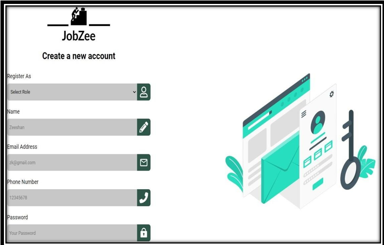
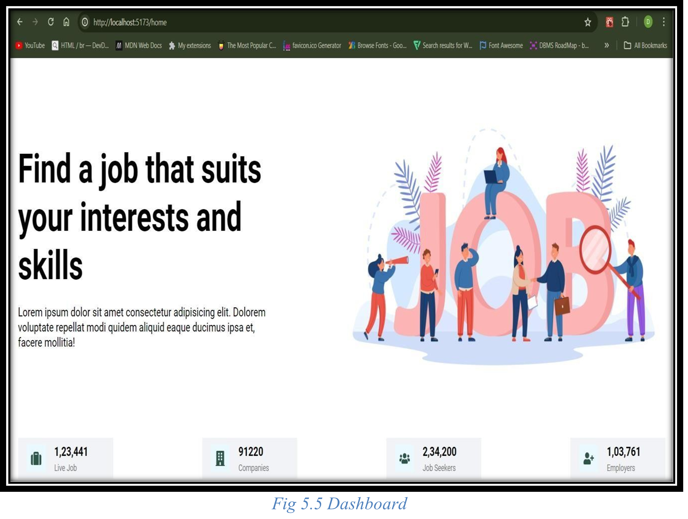
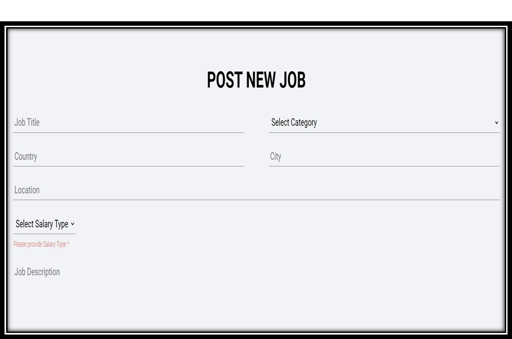
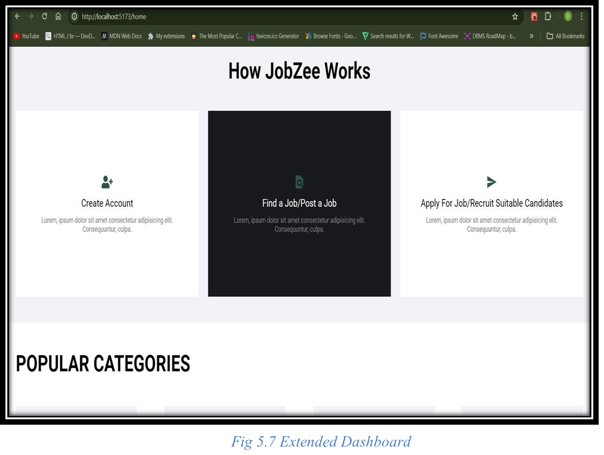
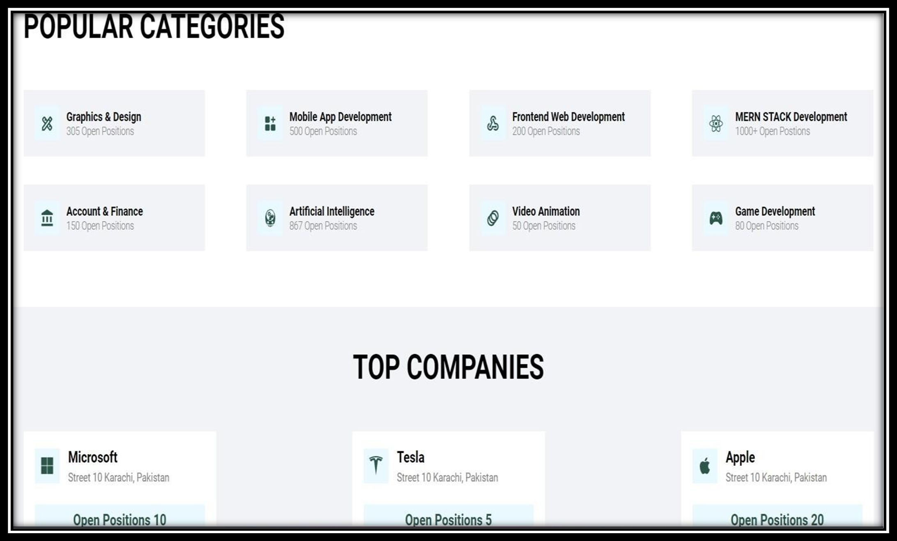

# 💼 Jobzee – Job Consultancy Platform


**Jobzee** is a full-featured, web-based job consultancy platform built using the **MERN stack** (MongoDB, Express.js, React.js, Node.js). It bridges the gap between job seekers and employers by offering a **secure, streamlined, and interactive experience**.

---

## 📊 **Project PPT**
You can view and download the full project presentation here:
[Watch the ppt here](https://docs.google.com/presentation/d/1VFy8hgUhqYjd5mZJNNzBKNOvscA7AZ6y/edit?usp=drive_web&ouid=112394308572245650485&rtpof=true)

## 📽️ **Video Explanation**
Watch a detailed video explaining the features and functionality of Jobzee:
[Watch the video here](https://drive.google.com/drive/folders/1AoWjkZ9j0rnU_KfXhPqYKpdMNjOiTyRh)

## 🖼️ **Poster**
Here’s a poster showcasing the key aspects of Jobzee:
[Jobzee Poster](assets/jobzee_poster.pdf)

## 📄 **Report**
You can view and download the full project report here:
[Jobzee Project Report](assets/Report.pdf)

## 🖼️ Screenshots

Below are some key screenshots of the Jobzee platform.  
*(You can also view these in the detailed project report.)*

### 🔐 Login Page


### 📊 Dashboard


### 📝 Post New Job


### 📈 Extended Dashboard


### 📈 Extended Dashboard 2


---

### 🛠️ **Tech Stack**

- **MongoDB** – Scalable NoSQL database for managing job listings, user profiles, and messages.
- **Express.js** – Backend framework for building RESTful APIs and handling server-side logic.
- **React.js** – Dynamic frontend with reusable UI components for a seamless user experience.
- **Node.js** – JavaScript runtime for scalable backend applications.
- **JWT Authentication** – Secure user login and session management.
- **Socket.io** – Real-time messaging between job seekers and recruiters.
- **Axios** – HTTP client for smooth frontend-backend communication.

---

### 👨‍💼 **Features for Job Seekers**

- **Profile Management** – Create and manage personal profiles, upload resumes, and track job applications.
- **Job Search & Filtering** – Search and apply for jobs based on skills, experience, location, and more.
- **Real-Time Messaging** – Direct communication with employers and recruiters.
- **Job Recommendations** – Personalized job suggestions tailored to your skills and preferences.

---

### 🏢 **Features for Employers**

- **Job Listings** – Post job openings and manage them easily.
- **Candidate Search** – Search and filter candidate profiles to find the best match.
- **Real-Time Messaging** – Instant communication with potential candidates.
- **Advanced Filtering** – Filter candidates by skills, experience, and more.

---

### 💡 **Why Choose Jobzee?**

Jobzee simplifies the **job search and recruitment process** for both job seekers and employers. With a **clean, user-friendly interface**, **real-time communication**, and **advanced matching algorithms**, Jobzee helps users find the right opportunities or candidates faster and more efficiently.

---

### 🚀 **Installation Guide**

**Prerequisites:**
- Node.js  
- MongoDB (or [MongoDB Atlas](https://www.mongodb.com/cloud/atlas) for cloud-hosted database)

#### **Steps to Install:**

1. **Clone the repository**:
   ```bash
   git clone https://github.com/your-username/Jobzee.git
   cd Jobzee
   ```

2. **Install dependencies**:
   - **Backend**:
     ```bash
     cd backend
     npm install
     ```
   - **Frontend**:
     ```bash
     cd ../frontend
     npm install
     ```

3. **Set up environment variables**:
   - Create a `.env` file in the `/backend` folder with the following content:
     ```
     MONGO_URI=your_mongo_connection_string
     JWT_SECRET=your_jwt_secret
     PORT=5000
     ```

4. **Run the application**:
   - **Backend**:
     ```bash
     cd backend
     npm start
     ```
   - **Frontend**:
     ```bash
     cd ../frontend
     npm start
     ```

   **URLs**:
   - **Backend**: [http://localhost:5000](http://localhost:5000)
   - **Frontend**: [http://localhost:3000](http://localhost:3000)

---

### 🤝 **Contributing**

We welcome contributions!  
To contribute to Jobzee, follow these steps:

1. **Fork** the repository.
2. **Create a new branch**:
   ```bash
   git checkout -b feature/your-feature-name
   ```
3. **Commit your changes**:
   ```bash
   git commit -am 'Add new feature'
   ```
4. **Push your changes** to your forked repository:
   ```bash
   git push origin feature/your-feature-name
   ```
5. **Create a pull request** to the main branch.

---

### 📄 **License**

This project is licensed under the **MIT License**. See the [LICENSE](LICENSE) file for details.

---

### 👤 **Author**

**Naman Bhayana**  
🔗 [LinkedIn](https://www.linkedin.com/in/namanbhayana007)  

---

### 📑 **Acknowledgements**

- Thanks to the [MERN Stack](https://mern.io/) community for the great tools!
- [Socket.io](https://socket.io/) for real-time messaging capabilities.
- [MongoDB](https://www.mongodb.com/) and [Express.js](https://expressjs.com/) for building the backend.

---

Feel free to modify and personalize the repository, and contribute to making Jobzee even better!
